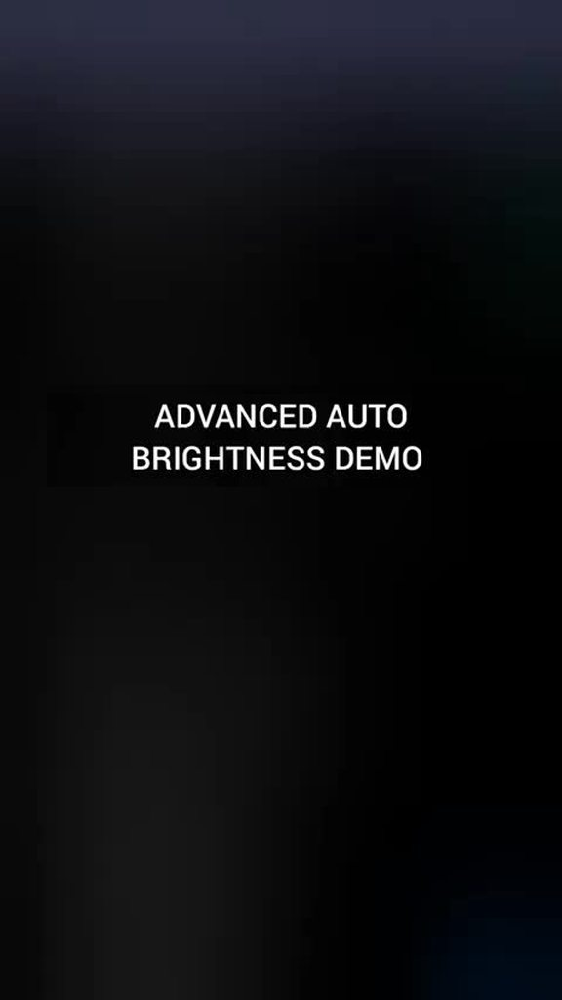

    

**Author**: [/u/v_uurtjevragen](https://www.reddit.com/user/v_uurtjevragen)
**Project version**: 3.0

# Advanced Auto Brightness 3.0

A Tasker‑only replacement for Android auto‑brightness.

> Requires Tasker 6.6.2‑beta or newer. Older versions fail to import with “Unknown Action: Get Sunrise/Sunset.”

## Features
- Plugin‑free engine (Tasker‑only)
- Proximity‑aware (no changes in pocket/at ear)
- Dynamic dead‑zone + adaptive smoothing (no flicker)
- Circadian scaling (sunrise/sunset adjusts tone)
- Manual override + foreground controls
- Watchdog throttle (recovers if idle)

## Quick Start
Helpful links: [User Guide](docs/user-guide.md) · [Discussions](https://github.com/faded-penguin021/Advanced-Auto-Brightness/discussions) · [Releases](https://github.com/faded-penguin021/Advanced-Auto-Brightness/releases)

1. Install Tasker.
2. Download the latest release.
3. In Tasker: long‑press the home icon (bottom left) → Import Project.

## Download
- Standalone app (no Tasker required): Advanced-Auto-Brightness.apk in Releases

> Note: In the standalone app build (Tasker App Factory), sunrise/sunset (circadian scaling) is unavailable; the feature is off and hidden by default.

| APK (no Tasker) | Tasker project (.prj.xml) |
| --- | --- |
|  |  |

- Direct links: [App APK](https://github.com/faded-penguin021/Advanced-Auto-Brightness/releases/latest/download/Advanced-Auto-Brightness.apk) · [Project file](https://github.com/faded-penguin021/Advanced-Auto-Brightness/releases/latest/download/Advanced-Auto-Brightness.prj.xml)

## Demo

## How it works
- Event‑driven monitor: reacts only when light change exits a dynamic dead‑zone
- Smoothing: adaptive alpha (big changes fast; small changes slow)
- Curve mapping: three zones (dark/indoor/bright) → clamped to min/max
- State machine: Initialize on screen‑on; Hibernate on screen‑off
- Proximity gate: pause/dampen while covered
- Manual override: respects user slider; resume via notification
- Watchdog: resets throttle if system goes idle
- Circadian scaling: tweaks curve by solar events (sunrise/sunset)

## Technical details
- Variables are namespaced as `AAB_*` (e.g., `%AAB_MinBright`) to avoid conflicts

## Profile map
- Initialize (screen‑on) → set & start
- Hibernate (screen‑off) → stop & clear
- Monitor Ambient Light → dead‑zone filtered events
- Proximity Detection → near/far gating
- Manual Override → pause/resume service
- Dynamic Scale Engine → sunrise/sunset curve scaling

## Troubleshooting
- “Unknown Action: Get Sunrise/Sunset” → update Tasker to 6.6.2‑beta+
- Too slow/fast → adjust Delta factor (dynamic alpha). Taper rates don’t change responsiveness
- Flicker → increase dead‑zone or smoothing
- No changes → grant Modify System Settings; disable battery optimizations

## License
MIT. See `LICENSE`.

## Requirements
- Tasker 6.6.2‑beta+ for sunrise/sunset actions (join beta via Play Store → “Join the beta”) · Reddit info: https://www.reddit.com/r/tasker/comments/1lulpiq/dev_tasker_662beta_shizuku_integration/
- Tasker 6.6+ and Android 10+ recommended; Permissions: Modify System Settings; Notification access
