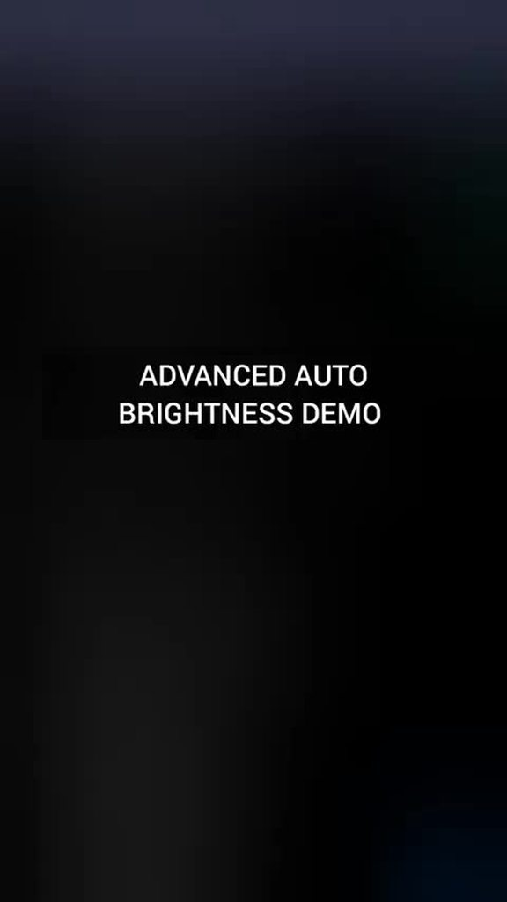

# Advanced Auto Brightness 3.0

Links: [User Guide](./user-guide.html) · [Releases](https://github.com/faded-penguin021/Advanced-Auto-Brightness/releases) · [Discussions](https://github.com/faded-penguin021/Advanced-Auto-Brightness/discussions)

Author: [/u/v_uurtjevragen](https://www.reddit.com/user/v_uurtjevragen) · Version: 3.0

A Tasker‑only replacement for Android auto‑brightness.

- Website: https://faded-penguin021.github.io/Advanced-Auto-Brightness/
- Repo: https://github.com/faded-penguin021/Advanced-Auto-Brightness
- Download latest: https://github.com/faded-penguin021/Advanced-Auto-Brightness/releases/latest/download/Advanced-Auto-Brightness.prj.xml

> Requires Tasker 6.6.2‑beta or newer. Older versions fail to import with “Unknown Action: Get Sunrise/Sunset.”

## Quick Start
1. Install Tasker
2. Download the `.prj.xml` above
3. In Tasker, long‑press the home icon (bottom left) → Import Project

## Features
- Plugin‑free engine (Tasker‑only)
- Proximity‑aware (no changes in pocket/at ear)
- Dynamic dead‑zone + adaptive smoothing (no flicker)
- Circadian scaling (sunrise/sunset adjusts tone)
- Manual override + foreground controls
- Watchdog throttle (recovers if idle)

## Demo

## How it works
- Event‑driven monitor: reacts only when light change exits a dynamic dead‑zone
- Smoothing: adaptive alpha (big changes fast; small changes slow)
- Curve mapping: three zones (dark/indoor/bright) → clamped to min/max
- State machine: Initialize on screen‑on; Hibernate on screen‑off
- Proximity gate: pause/dampen while covered
- Manual override: respects user slider; resume via notification
- Watchdog: resets throttle if system goes idle
- Circadian scaling: tweaks curve by solar events (sunrise/sunset)

## Technical details
- Variables are namespaced as `AAB_*` to avoid conflicts

## Download
- Standalone app (no Tasker required): Advanced-Auto-Brightness.apk in Releases

> Note: In the standalone app build (Tasker App Factory), sunrise/sunset (circadian scaling) is unavailable; the feature is off and hidden by default.

| APK (no Tasker) | Tasker project (.prj.xml) |
| --- | --- |
|  |  |

- Direct links: [App APK](https://github.com/faded-penguin021/Advanced-Auto-Brightness/releases/latest/download/Advanced-Auto-Brightness.apk) · [Project file](https://github.com/faded-penguin021/Advanced-Auto-Brightness/releases/latest/download/Advanced-Auto-Brightness.prj.xml)

## Requirements
- Tasker 6.6.2‑beta+ for sunrise/sunset actions (join beta via Play Store → “Join the beta”) · Reddit: https://www.reddit.com/r/tasker/comments/1lulpiq/dev_tasker_662beta_shizuku_integration/
- Without the beta, the project imports but the circadian engine won’t be available

## Troubleshooting
- Brightness not changing: grant Modify System Settings · disable battery optimizations
- Flicker: increase the Reactivity dead‑zone or smoothing
- Too slow/fast: adjust Delta factor (dynamic alpha). Taper rates don’t change responsiveness

## Updating
Replace `tasker/Advanced-Auto-Brightness.prj.xml` and push a tag like `v3.0.1` to publish a release.
